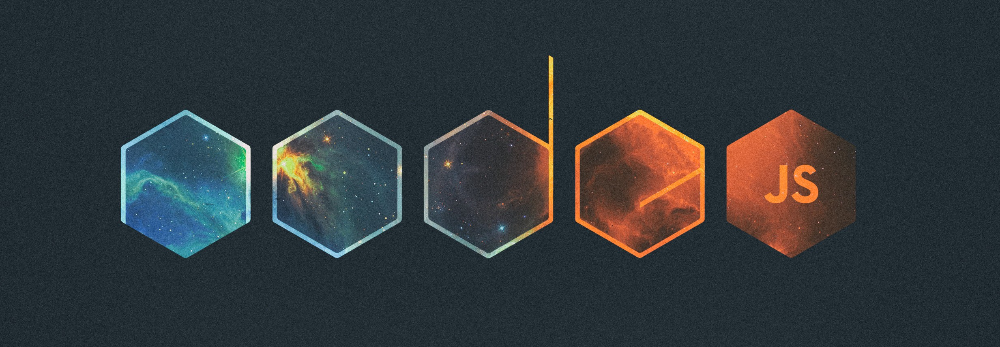

<h1 align="center">Hi 👋, I'm Jabbar Rustamov</h1>
<h3 align="center">Passionate Front-End Developer with hands-on experience in JavaScript, TypeScript, React, CSS3, HTML5 and responsive web design. Continuously learning and exploring new technologies to enhance web experiences.</h3>

- ✨ Passionate about building scalable web apps with **React & Node.js**

- 🛠️ Currently exploring: **Express.js & TypeScript**

- 💬 Ask me about **TailwindCss, React, Node.js, Express.js**

- 🔗 Check my projects: **https://github.com/jabbarrs**

- 📫 How to reach me **cabbarustemov@gmail.com**

<h3 align="left">Connect with me:</h3>

<h3 align="left">Languages and Tools:</h3>

  

  

  

  

  

  

  

  

  

  

  

  

  

  

  

  

  

  
  

